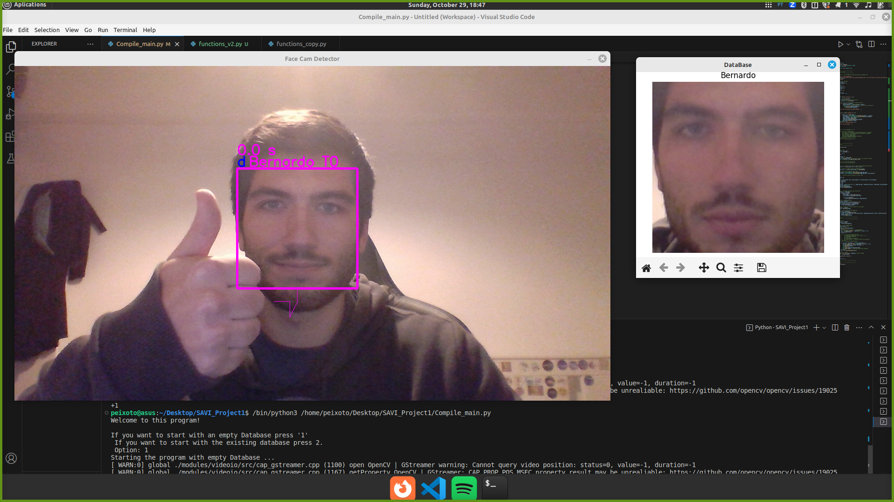

# Sistema Inteligente de Reconhecimento de Facial


# Index

  * [Introdução](#Introdução)
  * [Funcionalidades ](#Funcionalidades)
  * [Requisitos](#Requisitos)
  * [Utilização](#Utilização)
  * [Autores](#Autores)

<div align="center">
  
</div>

## Introdução

Este projeto é um sistema inteligente que utiliza uma câmara a bordo do computador para detetar e reconhecer rostos em tempo real. Oferece o reconhecimento facial de pessoas do grupo, com cumprimentos e o seguimento das deteções.
Este projeto foi desenvolvido no âmbito da discplina de Sistemas Avançados de Visão Industrial.

<div align="center">
  
</div>


## Funcionalidades 

1. **Detecção de Caras em Tempo Real:** O sistema é capaz de detetar automaticamente rostos humanos quando alguém se aproxima da câmara.

2. **Reconhecimento de Pessoas:** Além da deteção, o sistema identifica e reconhece as pessoas presentes com base em uma base de dados pré-gravada.

3. **Visualização em Tempo Real da Base de Dados:** É possível visualizar a base de dados em tempo real sobre pessoas conhecidas.

4. **Identificação de Pessoas Desconhecidas:** Quando uma pessoa desconhecida é detetada, o sistema permite ao usuário fornecer informações sobre essa pessoa nomeadamente o nome.

5. **Cumprimentos Personalizados:** O sistema cumprimenta as pessoas conhecidas com mensagens personalizadas, como "Olá <nome da pessoa>".

6. **Seguimento de Pessoas na Sala:** O sistema mantém o seguimento das pessoas na sala e mantém a identificação sobre as pessoas reconhecidas, mesmo que, em algum momento, não seja possível reconhecê-las.


## Requisitos

- Python 3.6 ou superior
- Bibliotecas:`opencv-python`
              `face-recognition`
              `matplotlib`
              `pyttsx3`
              `kivy`
## Utilização

- Clone o repositório:
```
git clone https://github.com/AdrianoFF10/SAVI_Project1
```

- Execute o programa: 
```
python3 main.py
```
Certifique-se de criar uma base de dados de imagens de pessoas conhecidas na pasta "Database" antes de executar o sistema.


## Autores

- [@AdrianoFF10](https://github.com/AdrianoFF10) - adrianofigueiredo7@ua.pt  104192
- [@bpeixoto02](https://github.com/bpeixoto02) - bernardo.peixoto@ua.pt 103050

