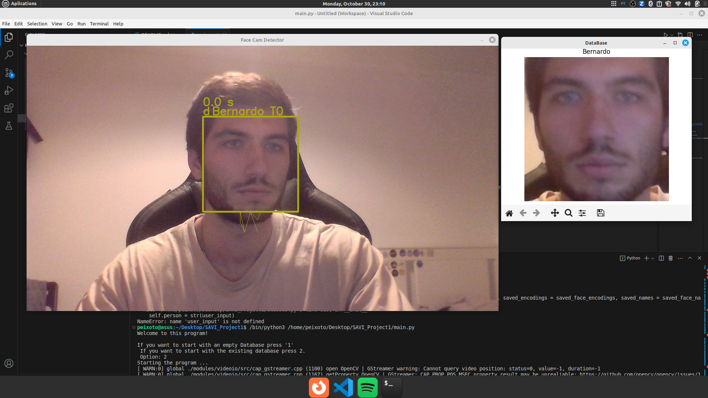

# Sistema Inteligente de Reconhecimento de Facial


# Index

  * [Introdução](#Introdução)
  * [Funcionalidades ](#Funcionalidades)
  * [Funcionamento](#funcionamento)
  * [Requisitos](#Requisitos)
  * [Utilização](#Utilização)
  * [Demonstração](#demonstração)
  * [Autores](#Autores)

<div align="center">
  
</div>

## Introdução

Este projeto é um sistema inteligente que utiliza uma câmara associada ao computador para detetar e reconhecer rostos em tempo real. Oferece o reconhecimento facial de pessoas do grupo, com cumprimentos e o seguimento das deteções. Este projeto foi desenvolvido no âmbito da discplina de Sistemas Avançados de Visão Industrial.

<div align="center">
  
</div>


## Funcionalidades 

1. **Detecção de Caras em Tempo Real:** O sistema é capaz de detetar automaticamente rostos humanos quando alguém se aproxima da câmara.

2. **Reconhecimento de Pessoas:** Além da deteção, o sistema identifica e reconhece as pessoas presentes com base em uma base de dados pré-gravada.

3. **Visualização em Tempo Real da Base de Dados:** É possível visualizar a base de dados em tempo real sobre pessoas conhecidas.

4. **Identificação de Pessoas Desconhecidas:** Quando uma pessoa desconhecida é detetada, o sistema permite ao usuário fornecer informações sobre essa pessoa nomeadamente o nome. Para isso surge um pop-up com a sua imagem, permitindo à mesma identificar-se.

5. **Cumprimentos Personalizados:** O sistema cumprimenta as pessoas conhecidas com mensagens personalizadas, como "Olá <nome da pessoa>".

6. **Seguimento de Pessoas na Sala:** O sistema mantém o seguimento das pessoas na sala e mantém a identificação sobre as pessoas reconhecidas, mesmo que, em algum momento, não seja possível reconhecê-las.


## Funcionamento

A partir do momento que se inicia o programa, este tenta encontrar faces na imagem. A partir do momento que isto acontece, caso ele conheça a cara, cumprimenta essa pessoa e começa a seguir a face da mesma. Caso não conheça, surge uma janela pop-up com uma imagem da cara detetada, onde aparece também uma caixa de texto onde a pessoa deve inserir o seu nome. Seguidamente, tal como anteriormente, o programa cumprimenta a pessoa e começa a efetuar o seguimento dessa cara.

Além disso, é desenhada uma linha que representa todos os locais onde a face foi detetada. 

É possível visualizar em todos os momentos as caras adicionadas presentes na base de dados inicial, sendo que esta atualiza quando são adicionadas detetadas novas pessoas. 

Por fim, no início do programa, surge um menu onde se pergunta se é pretendido iniciar o mesmo com a database existente ou se se pretende uma database vazia.

## Requisitos

- Python 3.6 ou superior
- Bibliotecas:
* `opencv-python`
É uma biblioteca Open Source utilizada para deteção de objetos e seguimento de movimentos através de imagens e vídeos.

```
pip install opencv-python
```

* `face-recognition`
Construído com base no OpenCv


```
pip install dlib
```
Followed by

```
pip install face-recognition

```

* `matplotlib`


```
pip install matplotlib

```
* `pyttsx3`


```
pip install pyttsx3

```


## Utilização

- Clone o repositório:
```
git clone https://github.com/AdrianoFF10/SAVI_Project1
```

- Execute o programa: 
```
python3 main.py
```
Certifique-se de criar uma base de dados de imagens de pessoas conhecidas na pasta "Database" antes de executar o sistema.

## Demonstração

[](https://youtu.be/OAntO71JFXc)


## Autores

- [@AdrianoFF10](https://github.com/AdrianoFF10) - adrianofigueiredo7@ua.pt  104192
- [@bpeixoto02](https://github.com/bpeixoto02) - bernardo.peixoto@ua.pt 103050

